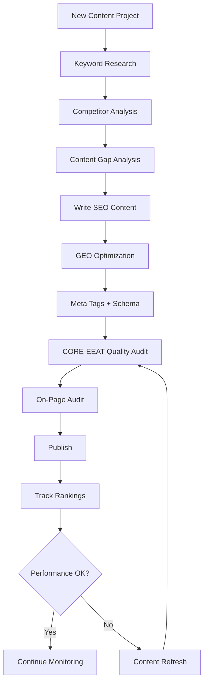

# SEO & GEO Skills Library

**20 skills. 15 commands. Rank in search. Get cited by AI.**

[](https://github.com/aaron-he-zhu/seo-geo-claude-skills)
[](https://github.com/aaron-he-zhu/seo-geo-claude-skills/blob/main/VERSIONS.md)
[](https://github.com/aaron-he-zhu/seo-geo-claude-skills/blob/main/LICENSE)
[](https://github.com/aaron-he-zhu/seo-geo-claude-skills/commits/main)
[](https://claude.ai/download)

[English](README.md) | [中文](docs/README.zh.md)

Claude Skills and Commands for Search Engine Optimization (SEO) and Generative Engine Optimization (GEO). Zero dependencies, works with [Claude Code](https://claude.ai/download), [Cursor](https://cursor.com), [Codex](https://openai.com/codex), and [35+ other agents](https://skills.sh). Content quality scored by the [CORE-EEAT Benchmark](https://github.com/aaron-he-zhu/core-eeat-content-benchmark) (80 items). Domain authority scored by [CITE Domain Rating](https://github.com/aaron-he-zhu/cite-domain-rating) (40 items).

> **SEO** gets you ranked in search results. **GEO** gets you cited by AI systems (ChatGPT, Perplexity, Google AI Overviews). This library covers both.

## Quick Start in 60 seconds

1. **Install** (full table below at [Installation](#installation)):
   - **Claude Code**: `/plugin marketplace add aaron-he-zhu/seo-geo-claude-skills`
   - **OpenClaw**: [clawhub.ai/plugins/aaron-seo-geo](https://clawhub.ai/plugins/aaron-seo-geo)
   - **Universal (any agent)**: `npx skills add aaron-he-zhu/seo-geo-claude-skills`

2. **Try it** — a skill auto-activates from natural language:
   ```
   Research keywords for my SaaS product targeting small teams
   ```

3. **Or use a command**: `/seo:audit-page https://example.com/blog/my-article`

## Installation

| Your tool | Install command |
|-----------|----------------|
| **Claude Code** | `/plugin marketplace add aaron-he-zhu/seo-geo-claude-skills` |
| **OpenClaw** | `clawhub install aaron-he-zhu/<skill>` · [bundle](https://clawhub.ai/plugins/aaron-seo-geo) |
| **Gemini CLI** | `gemini extensions install https://github.com/aaron-he-zhu/seo-geo-claude-skills` |
| **Qwen Code** | `qwen extensions install https://github.com/aaron-he-zhu/seo-geo-claude-skills` |
| **Amp** | `amp skill add aaron-he-zhu/seo-geo-claude-skills` |
| **Kimi Code CLI** | `kimi plugin install https://github.com/aaron-he-zhu/seo-geo-claude-skills.git` |
| **CodeBuddy** | `/plugin marketplace add aaron-he-zhu/seo-geo-claude-skills` then `/plugin install aaron-seo-geo` |
| **Cursor / Codex / Windsurf / Cline / Copilot / [35+ more](https://github.com/vercel-labs/skills#supported-agents)** | `npx skills add aaron-he-zhu/seo-geo-claude-skills` |

Single skill: `npx skills add aaron-he-zhu/seo-geo-claude-skills -s keyword-research`

<details>
<summary>Alternative install methods (submodule, fork, manual, local plugin)</summary>

```bash
# Git submodule (version-pinned)
git submodule add https://github.com/aaron-he-zhu/seo-geo-claude-skills.git .claude/skills/seo-geo
git submodule update --remote .claude/skills/seo-geo   # update

# Claude Code local plugin
claude --plugin-dir ./seo-geo-claude-skills

# Fork & customize
git clone https://github.com/YOUR-ORG/seo-geo-claude-skills.git
npx skills add YOUR-ORG/seo-geo-claude-skills

# Manual
git clone https://github.com/aaron-he-zhu/seo-geo-claude-skills.git
mkdir -p ~/.claude/skills/ && cp -r seo-geo-claude-skills/* ~/.claude/skills/
```

</details>

After install: `Research keywords for [your topic]` or `/seo:audit-page <URL>`. Optionally connect tools via [CONNECTORS.md](https://github.com/aaron-he-zhu/seo-geo-claude-skills/blob/main/CONNECTORS.md).

## Operating Model

Every skill follows one contract: trigger, quick start, skill contract, handoff summary, next best skill. Four cross-cutting skills form the protocol layer: `content-quality-auditor` (publish gate), `domain-authority-auditor` (trust gate), `entity-optimizer` (entity profile), `memory-management` (memory loop). Prompt-based hooks automate session start/end and post-write audit recommendations. Three-tier memory (HOT/WARM/COLD) persists context across sessions. Shared refs: [skill-contract.md](https://github.com/aaron-he-zhu/seo-geo-claude-skills/blob/main/references/skill-contract.md) · [state-model.md](https://github.com/aaron-he-zhu/seo-geo-claude-skills/blob/main/references/state-model.md).

### Where to Begin

| Your Goal | Start Here | Then |
|-----------|-----------|------|
| Starting from scratch | `keyword-research` → `competitor-analysis` | → `seo-content-writer` |
| Write new content | `keyword-research` | → `seo-content-writer` + `geo-content-optimizer` |
| Improve existing content | `/seo:audit-page <URL>` | → `content-refresher` or `seo-content-writer` |
| Fix technical issues | `/seo:check-technical <URL>` | → `technical-seo-checker` |
| Assess domain authority | `/seo:audit-domain <domain>` | → `backlink-analyzer` |
| Full quality assessment | `content-quality-auditor` + `domain-authority-auditor` | → 120-item combined report |
| Build entity/brand presence | `entity-optimizer` | → `schema-markup-generator` + `geo-content-optimizer` |
| Generate performance report | `/seo:report <domain> <period>` | → periodic monitoring |

## Methodology

```
 RESEARCH          BUILD            OPTIMIZE          MONITOR
 ─────────         ─────────        ─────────         ─────────
 Keywords          Content          On-Page           Rankings
 Competitors       Meta Tags        Technical         Backlinks
 SERP              Schema           Links             Performance
 Gaps              GEO              Refresh           Alerts

 CROSS-CUTTING / PROTOCOL LAYER ─────────────────────────────────
 Content Quality Gate · Citation Trust Gate · Entity Truth · Memory Loop
```

## Skills

<!-- SKILLS:START -->
### Research — understand your market before creating content

| Skill | What it does |
|-------|-------------|
| [keyword-research](https://github.com/aaron-he-zhu/seo-geo-claude-skills/blob/main/research/keyword-research/SKILL.md) | Discover keywords with intent analysis, difficulty scoring, and topic clustering |
| [competitor-analysis](https://github.com/aaron-he-zhu/seo-geo-claude-skills/blob/main/research/competitor-analysis/SKILL.md) | Analyze competitor SEO/GEO strategies and find their weaknesses |
| [serp-analysis](https://github.com/aaron-he-zhu/seo-geo-claude-skills/blob/main/research/serp-analysis/SKILL.md) | Analyze search results and AI answer patterns for target queries |
| [content-gap-analysis](https://github.com/aaron-he-zhu/seo-geo-claude-skills/blob/main/research/content-gap-analysis/SKILL.md) | Find content opportunities your competitors cover but you don't |

### Build — create content optimized for search and AI

| Skill | What it does |
|-------|-------------|
| [seo-content-writer](https://github.com/aaron-he-zhu/seo-geo-claude-skills/blob/main/build/seo-content-writer/SKILL.md) | Write search-optimized content with proper structure and keyword placement |
| [geo-content-optimizer](https://github.com/aaron-he-zhu/seo-geo-claude-skills/blob/main/build/geo-content-optimizer/SKILL.md) | Make content quotable and citable by AI systems |
| [meta-tags-optimizer](https://github.com/aaron-he-zhu/seo-geo-claude-skills/blob/main/build/meta-tags-optimizer/SKILL.md) | Create compelling titles, descriptions, and Open Graph tags |
| [schema-markup-generator](https://github.com/aaron-he-zhu/seo-geo-claude-skills/blob/main/build/schema-markup-generator/SKILL.md) | Generate JSON-LD structured data for rich results |

### Optimize — improve existing content and technical health

| Skill | What it does |
|-------|-------------|
| [on-page-seo-auditor](https://github.com/aaron-he-zhu/seo-geo-claude-skills/blob/main/optimize/on-page-seo-auditor/SKILL.md) | Audit on-page elements with a scored report and fix recommendations |
| [technical-seo-checker](https://github.com/aaron-he-zhu/seo-geo-claude-skills/blob/main/optimize/technical-seo-checker/SKILL.md) | Check crawlability, indexing, Core Web Vitals, and site architecture |
| [internal-linking-optimizer](https://github.com/aaron-he-zhu/seo-geo-claude-skills/blob/main/optimize/internal-linking-optimizer/SKILL.md) | Optimize internal link structure for better crawling and authority flow |
| [content-refresher](https://github.com/aaron-he-zhu/seo-geo-claude-skills/blob/main/optimize/content-refresher/SKILL.md) | Update outdated content to recover or improve rankings |

### Monitor — track performance and catch issues early

| Skill | What it does |
|-------|-------------|
| [rank-tracker](https://github.com/aaron-he-zhu/seo-geo-claude-skills/blob/main/monitor/rank-tracker/SKILL.md) | Track keyword positions over time in both SERP and AI responses |
| [backlink-analyzer](https://github.com/aaron-he-zhu/seo-geo-claude-skills/blob/main/monitor/backlink-analyzer/SKILL.md) | Analyze backlink profile, find opportunities, detect toxic links |
| [performance-reporter](https://github.com/aaron-he-zhu/seo-geo-claude-skills/blob/main/monitor/performance-reporter/SKILL.md) | Generate SEO/GEO performance reports for stakeholders |
| [alert-manager](https://github.com/aaron-he-zhu/seo-geo-claude-skills/blob/main/monitor/alert-manager/SKILL.md) | Set up alerts for ranking drops, traffic changes, and technical issues |

### Cross-cutting — protocol layer across all phases

| Skill | What it does |
|-------|-------------|
| [content-quality-auditor](https://github.com/aaron-he-zhu/seo-geo-claude-skills/blob/main/cross-cutting/content-quality-auditor/SKILL.md) | Publish Readiness Gate with full 80-item CORE-EEAT audit and ship/no-ship verdict |
| [domain-authority-auditor](https://github.com/aaron-he-zhu/seo-geo-claude-skills/blob/main/cross-cutting/domain-authority-auditor/SKILL.md) | Citation Trust Gate with full 40-item CITE audit and authority verdict |
| [entity-optimizer](https://github.com/aaron-he-zhu/seo-geo-claude-skills/blob/main/cross-cutting/entity-optimizer/SKILL.md) | Canonical Entity Profile for brand/entity truth across search and AI systems |
| [memory-management](https://github.com/aaron-he-zhu/seo-geo-claude-skills/blob/main/cross-cutting/memory-management/SKILL.md) | Campaign Memory Loop for durable context, promotion, and archive rules |
<!-- SKILLS:END -->

## Commands

One-shot tasks with explicit input and structured output.

### User commands (10)

| Command | Description |
|---------|-------------|
| `/seo:audit-page <URL>` | Full on-page SEO + CORE-EEAT content quality audit with scored report |
| `/seo:check-technical <URL>` | Technical SEO health check (crawlability, speed, security) |
| `/seo:generate-schema <type>` | Generate JSON-LD structured data markup |
| `/seo:optimize-meta <URL>` | Optimize title, description, and OG tags |
| `/seo:report <domain> <period>` | Comprehensive SEO/GEO performance report |
| `/seo:audit-domain <domain>` | Full CITE domain authority audit with 40-item scoring and veto checks |
| `/seo:write-content <topic>` | Write SEO + GEO optimized content from a topic and target keyword |
| `/seo:keyword-research <seed>` | Research and analyze keywords for a topic or niche |
| `/seo:setup-alert <metric>` | Configure monitoring alerts for critical metrics |
| `/seo:geo-drift-check [URL]` | (experimental, v9.0+) Validate GEO Score against actual AI-engine citations |

### Maintenance commands (5)

| Command | Description |
|---------|-------------|
| `/seo:wiki-lint` | Wiki health check: detect contradictions, orphans, stale claims |
| `/seo:contract-lint` | Auditor Runbook drift detection, handoff schema check (v7.1.0+) |
| `/seo:p2-review` | Evaluate v7.1.0 deferred items; tombstone review (2026-07-10) |
| `/seo:sync-versions` | Propagate version from plugin.json to all cross-agent manifests (v9.0+) |
| `/seo:validate-library` | Library-level quality gate: descriptions, YAML order, triggers (v9.0+) |

Command files: [commands/](https://github.com/aaron-he-zhu/seo-geo-claude-skills/tree/main/commands/)

## Recommended Workflow



**Skill combos that work well together:**

- **keyword-research** + **content-gap-analysis** → comprehensive content strategy
- **seo-content-writer** + **geo-content-optimizer** → dual-optimized content
- **on-page-seo-auditor** + **technical-seo-checker** → complete site audit
- **content-quality-auditor** + **domain-authority-auditor** → complete 120-item assessment
- **entity-optimizer** + **schema-markup-generator** → complete entity markup
- **memory-management** + any skill → persistent project context

## Inter-Skill Handoff Protocol

When a skill points to its `Next Best Skill`, pass: objective, key findings, evidence, open loops, target keyword, content type, CORE-EEAT scores (e.g., `C:75 O:60 R:80 E:45`), CITE scores + veto status, priority item IDs, and content URL. If `memory-management` is active, prior results auto-load from hot cache.

## Reference Materials

| Reference | Items | Used by |
|-----------|:-----:|---------|
| [core-eeat-benchmark.md](https://github.com/aaron-he-zhu/seo-geo-claude-skills/blob/main/references/core-eeat-benchmark.md) | 80 | content-quality-auditor, seo-content-writer, geo-content-optimizer, content-refresher, on-page-seo-auditor |
| [cite-domain-rating.md](https://github.com/aaron-he-zhu/seo-geo-claude-skills/blob/main/references/cite-domain-rating.md) | 40 | domain-authority-auditor, backlink-analyzer, competitor-analysis, performance-reporter |

<details>
<summary>Finding the right skill (40-entry search index)</summary>

| You're looking for... | Use this skill |
|----------------------|---------------|
| Find keywords / topic ideas / what to write about | [keyword-research](https://github.com/aaron-he-zhu/seo-geo-claude-skills/blob/main/research/keyword-research/SKILL.md) |
| Search volume / long-tail keywords / ranking opportunities | [keyword-research](https://github.com/aaron-he-zhu/seo-geo-claude-skills/blob/main/research/keyword-research/SKILL.md) |
| Analyze competitors / competitive intelligence | [competitor-analysis](https://github.com/aaron-he-zhu/seo-geo-claude-skills/blob/main/research/competitor-analysis/SKILL.md) |
| Competitor keywords / competitor backlinks / benchmarking | [competitor-analysis](https://github.com/aaron-he-zhu/seo-geo-claude-skills/blob/main/research/competitor-analysis/SKILL.md) |
| SERP analysis / featured snippets / what ranks for X | [serp-analysis](https://github.com/aaron-he-zhu/seo-geo-claude-skills/blob/main/research/serp-analysis/SKILL.md) |
| AI overviews / SERP features / why does this page rank | [serp-analysis](https://github.com/aaron-he-zhu/seo-geo-claude-skills/blob/main/research/serp-analysis/SKILL.md) |
| Content gaps / untapped topics / content opportunities | [content-gap-analysis](https://github.com/aaron-he-zhu/seo-geo-claude-skills/blob/main/research/content-gap-analysis/SKILL.md) |
| Competitor content analysis / content strategy gaps | [content-gap-analysis](https://github.com/aaron-he-zhu/seo-geo-claude-skills/blob/main/research/content-gap-analysis/SKILL.md) |
| Write a blog post / article / content creation | [seo-content-writer](https://github.com/aaron-he-zhu/seo-geo-claude-skills/blob/main/build/seo-content-writer/SKILL.md) |
| SEO copywriting / draft optimized content | [seo-content-writer](https://github.com/aaron-he-zhu/seo-geo-claude-skills/blob/main/build/seo-content-writer/SKILL.md) |
| Optimize for AI / get cited by ChatGPT | [geo-content-optimizer](https://github.com/aaron-he-zhu/seo-geo-claude-skills/blob/main/build/geo-content-optimizer/SKILL.md) |
| GEO optimization / appear in AI answers / LLM citations | [geo-content-optimizer](https://github.com/aaron-he-zhu/seo-geo-claude-skills/blob/main/build/geo-content-optimizer/SKILL.md) |
| Title tag / meta description / improve CTR | [meta-tags-optimizer](https://github.com/aaron-he-zhu/seo-geo-claude-skills/blob/main/build/meta-tags-optimizer/SKILL.md) |
| Open Graph / Twitter cards / social preview | [meta-tags-optimizer](https://github.com/aaron-he-zhu/seo-geo-claude-skills/blob/main/build/meta-tags-optimizer/SKILL.md) |
| Schema markup / JSON-LD / rich snippets | [schema-markup-generator](https://github.com/aaron-he-zhu/seo-geo-claude-skills/blob/main/build/schema-markup-generator/SKILL.md) |
| FAQ schema / How-To schema / product markup | [schema-markup-generator](https://github.com/aaron-he-zhu/seo-geo-claude-skills/blob/main/build/schema-markup-generator/SKILL.md) |
| On-page SEO audit / SEO score | [on-page-seo-auditor](https://github.com/aaron-he-zhu/seo-geo-claude-skills/blob/main/optimize/on-page-seo-auditor/SKILL.md) |
| Header tags / image optimization / check my page | [on-page-seo-auditor](https://github.com/aaron-he-zhu/seo-geo-claude-skills/blob/main/optimize/on-page-seo-auditor/SKILL.md) |
| Technical SEO / page speed / Core Web Vitals | [technical-seo-checker](https://github.com/aaron-he-zhu/seo-geo-claude-skills/blob/main/optimize/technical-seo-checker/SKILL.md) |
| Crawl issues / indexing problems / mobile-friendly | [technical-seo-checker](https://github.com/aaron-he-zhu/seo-geo-claude-skills/blob/main/optimize/technical-seo-checker/SKILL.md) |
| Internal links / site architecture / link structure | [internal-linking-optimizer](https://github.com/aaron-he-zhu/seo-geo-claude-skills/blob/main/optimize/internal-linking-optimizer/SKILL.md) |
| Page authority distribution / content silos | [internal-linking-optimizer](https://github.com/aaron-he-zhu/seo-geo-claude-skills/blob/main/optimize/internal-linking-optimizer/SKILL.md) |
| Update old content / content decay / refresh | [content-refresher](https://github.com/aaron-he-zhu/seo-geo-claude-skills/blob/main/optimize/content-refresher/SKILL.md) |
| Declining rankings / revive old blog posts | [content-refresher](https://github.com/aaron-he-zhu/seo-geo-claude-skills/blob/main/optimize/content-refresher/SKILL.md) |
| Track rankings / keyword positions | [rank-tracker](https://github.com/aaron-he-zhu/seo-geo-claude-skills/blob/main/monitor/rank-tracker/SKILL.md) |
| SERP monitoring / ranking trends | [rank-tracker](https://github.com/aaron-he-zhu/seo-geo-claude-skills/blob/main/monitor/rank-tracker/SKILL.md) |
| Analyze backlinks / link profile / toxic links | [backlink-analyzer](https://github.com/aaron-he-zhu/seo-geo-claude-skills/blob/main/monitor/backlink-analyzer/SKILL.md) |
| Link building / off-page SEO | [backlink-analyzer](https://github.com/aaron-he-zhu/seo-geo-claude-skills/blob/main/monitor/backlink-analyzer/SKILL.md) |
| SEO report / performance report / traffic report | [performance-reporter](https://github.com/aaron-he-zhu/seo-geo-claude-skills/blob/main/monitor/performance-reporter/SKILL.md) |
| SEO dashboard / report to stakeholders | [performance-reporter](https://github.com/aaron-he-zhu/seo-geo-claude-skills/blob/main/monitor/performance-reporter/SKILL.md) |
| SEO alerts / monitor rankings / notifications | [alert-manager](https://github.com/aaron-he-zhu/seo-geo-claude-skills/blob/main/monitor/alert-manager/SKILL.md) |
| Traffic alerts / watch competitor changes | [alert-manager](https://github.com/aaron-he-zhu/seo-geo-claude-skills/blob/main/monitor/alert-manager/SKILL.md) |
| Content quality audit / EEAT score | [content-quality-auditor](https://github.com/aaron-he-zhu/seo-geo-claude-skills/blob/main/cross-cutting/content-quality-auditor/SKILL.md) |
| CORE-EEAT audit / content assessment | [content-quality-auditor](https://github.com/aaron-he-zhu/seo-geo-claude-skills/blob/main/cross-cutting/content-quality-auditor/SKILL.md) |
| Domain authority audit / domain trust | [domain-authority-auditor](https://github.com/aaron-he-zhu/seo-geo-claude-skills/blob/main/cross-cutting/domain-authority-auditor/SKILL.md) |
| CITE audit / domain rating | [domain-authority-auditor](https://github.com/aaron-he-zhu/seo-geo-claude-skills/blob/main/cross-cutting/domain-authority-auditor/SKILL.md) |
| Entity optimization / knowledge graph | [entity-optimizer](https://github.com/aaron-he-zhu/seo-geo-claude-skills/blob/main/cross-cutting/entity-optimizer/SKILL.md) |
| Brand entity / entity disambiguation | [entity-optimizer](https://github.com/aaron-he-zhu/seo-geo-claude-skills/blob/main/cross-cutting/entity-optimizer/SKILL.md) |
| Remember project context / track campaign | [memory-management](https://github.com/aaron-he-zhu/seo-geo-claude-skills/blob/main/cross-cutting/memory-management/SKILL.md) |
| Store keyword data / save progress | [memory-management](https://github.com/aaron-he-zhu/seo-geo-claude-skills/blob/main/cross-cutting/memory-management/SKILL.md) |

</details>

Browse all 20 skills: [GitHub](https://github.com/aaron-he-zhu/seo-geo-claude-skills) · [ClawHub](https://clawhub.ai/u/aaron-he-zhu) · [skills.sh](https://skills.sh/aaron-he-zhu/seo-geo-claude-skills)

## Contributing

See [CONTRIBUTING.md](https://github.com/aaron-he-zhu/seo-geo-claude-skills/blob/main/CONTRIBUTING.md) for how to add new skills, improve existing ones, or request features.

## Ecosystem

| Repository | What it provides | How it connects |
|------------|-----------------|-----------------|
| [CORE-EEAT Content Benchmark](https://github.com/aaron-he-zhu/core-eeat-content-benchmark) | 80-item content quality scoring framework | Powers `content-quality-auditor` and publish readiness gate |
| [CITE Domain Rating](https://github.com/aaron-he-zhu/cite-domain-rating) | 40-item domain authority scoring framework | Powers `domain-authority-auditor` and citation trust gate |

## Community

- [Report a bug](https://github.com/aaron-he-zhu/seo-geo-claude-skills/issues/new?template=bug-report.yml) · [Request a feature](https://github.com/aaron-he-zhu/seo-geo-claude-skills/issues/new?template=feature-request.yml)
- [Contributing guide](https://github.com/aaron-he-zhu/seo-geo-claude-skills/blob/main/CONTRIBUTING.md) · [Security policy](https://github.com/aaron-he-zhu/seo-geo-claude-skills/blob/main/SECURITY.md) · [Code of Conduct](https://github.com/aaron-he-zhu/seo-geo-claude-skills/blob/main/CODE_OF_CONDUCT.md)

<details>
<summary>Terminology</summary>

**SEO (Search Engine Optimization)** — Improving a page so it ranks higher in Google, Bing, and other traditional search engines.

**GEO (Generative Engine Optimization)** — Structuring content so AI assistants (ChatGPT, Perplexity, Google AI Overviews) cite it in their answers.

**CORE-EEAT** — 80-item content quality framework scored across 8 dimensions. `GEO Score = CORE avg`, `SEO Score = EEAT avg`. See [references/core-eeat-benchmark.md](references/core-eeat-benchmark.md).

**CITE** — 40-item domain authority framework scored across 4 dimensions (Credibility, Infrastructure, Trust, Endorsement). See [references/cite-domain-rating.md](references/cite-domain-rating.md).

**Veto item** — A single scoring item that blocks publication or authority approval regardless of overall score when failed. CORE-EEAT has three (T04, C01, R10); CITE has three (T03, T05, T09).

**Cap (Critical Fail Cap)** — A ceiling applied to the final score when certain items fail, limiting the top score until the issue is fixed. See [references/contract-fail-caps.md](references/contract-fail-caps.md).

**Gate verdict** — The auditor's ship/no-ship decision: `SHIP`, `FIX_BEFORE_SHIP`, or `BLOCK`. Driven by veto items, caps, and score thresholds. See [references/auditor-runbook.md](references/auditor-runbook.md).

**Protocol layer** — Four cross-cutting skills enforcing quality: `content-quality-auditor` (publish gate), `domain-authority-auditor` (trust gate), `entity-optimizer` (entity profile), `memory-management` (memory loop).

**HOT / WARM / COLD tiers** — Three-temperature memory model. HOT is auto-loaded (80 lines, 25KB cap). WARM is on-demand. COLD is archival. See [references/state-model.md](references/state-model.md).

**Handoff summary** — Structured packet one skill passes to the next: objective, findings, evidence, open loops, keyword, content type, completion status, scores, priority items, URL.

**Skill vs. command** — A *skill* auto-activates from user prompts. A *command* is invoked explicitly with `/seo:<name>`.

**Tier 1 / 2 / 3 integration** — Tier 1: zero dependencies (every skill works standalone). Tier 2: MCP connectors for richer data. Tier 3: full toolchain with webhooks and sync. See [CONNECTORS.md](CONNECTORS.md).

</details>

## Disclaimer

These skills assist with SEO and GEO workflows but do not guarantee search rankings, AI citations, or traffic results. SEO and GEO outcomes depend on many factors outside the scope of this tool. Always verify recommendations with qualified professionals before making significant changes to your content strategy. AI-generated analysis should be reviewed by domain experts before being relied upon for business decisions.

**Not legal advice.** Several skills and references cite statutes, case law, and regulator guidance current as of release date. Laws and interpretations evolve; consult qualified legal counsel before relying on any legal summary in this repository.

## License

Apache License 2.0
