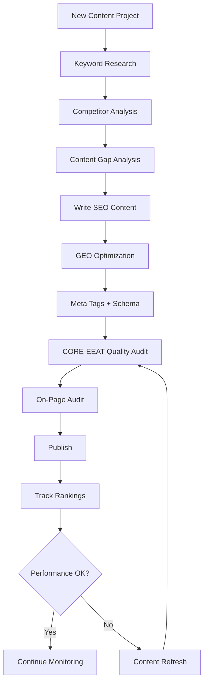

# SEO & GEO Skills Library

**20 skills. 10 commands. Rank in search. Get cited by AI.**

[](https://github.com/aaron-he-zhu/seo-geo-claude-skills)
[](https://github.com/aaron-he-zhu/seo-geo-claude-skills/blob/main/VERSIONS.md)
[](https://github.com/aaron-he-zhu/seo-geo-claude-skills/blob/main/LICENSE)
[](https://github.com/aaron-he-zhu/seo-geo-claude-skills/commits/main)
[](https://claude.ai/download)

[English](README.md) | [中文](docs/README.zh.md) | [日本語](docs/README.ja.md) | [한국어](docs/README.ko.md) | [Espanol](docs/README.es.md) | [Portugues](docs/README.pt.md)

Claude Skills and Commands for Search Engine Optimization (SEO) and Generative Engine Optimization (GEO). Zero dependencies, works with [Claude Code](https://claude.ai/download), [Cursor](https://cursor.com), [Codex](https://openai.com/codex), and [35+ other agents](https://skills.sh). Content quality scored by the [CORE-EEAT Benchmark](https://github.com/aaron-he-zhu/core-eeat-content-benchmark) (80 items). Domain authority scored by [CITE Domain Rating](https://github.com/aaron-he-zhu/cite-domain-rating) (40 items).

> **SEO** gets you ranked in search results. **GEO** gets you cited by AI systems (ChatGPT, Perplexity, Google AI Overviews). This library covers both.

### Why This Library

- **120-item quality frameworks** — CORE-EEAT (80 items) + CITE (40 items) with veto gates, not narrative guesswork
- **8 languages, 750+ triggers** — EN, ZH, JA, KO, ES, PT with formal, casual, and misspelling variants
- **Zero dependencies** — pure markdown skills, no Python, no venv, no API keys required
- **Tool-agnostic** — works standalone or with Ahrefs, Semrush, Google Search Console via MCP
- **6 install methods** — ClawHub, skills.sh, Claude Code plugin, git submodule, fork, manual

## Quick Start

> Works with [Claude Code](https://claude.ai/download), [OpenClaw](https://openclaw.com), [Cursor](https://cursor.com), [Codex](https://openai.com/codex), and [35+ other agents](https://skills.sh). No other dependencies.

1. **Install** — pick the method for your tool:

   | Your tool | Install command |
   |-----------|----------------|
   | **OpenClaw** | `clawhub install aaron-he-zhu/<skill-name>` — [browse all 20](https://clawhub.ai/u/aaron-he-zhu) |
   | **Claude Code** | `/plugin marketplace add aaron-he-zhu/seo-geo-claude-skills` (all 20) |
   | **Cursor / Codex / Windsurf / other** | `npx skills add aaron-he-zhu/seo-geo-claude-skills` (all 20) |

   > All installation methods remain available at all times. If any marketplace is temporarily unavailable, use an alternative method.

   Install a single skill via skills.sh:
   ```bash
   npx skills add aaron-he-zhu/seo-geo-claude-skills -s keyword-research
   ```

   <details>
   <summary>Claude Code Plugin (alternative)</summary>

   Already listed in the table above. Use this method if you need to load locally:

   ```bash
   # Or load locally
   claude --plugin-dir ./seo-geo-claude-skills
   ```

   Includes `marketplace.json`, `plugin.json`, and pre-configured MCP servers. See [CONNECTORS.md](https://github.com/aaron-he-zhu/seo-geo-claude-skills/blob/main/CONNECTORS.md) for MCP setup.

   </details>

   <details>
   <summary>Git Submodule (version-pinned)</summary>

   Add as a submodule for version-pinned updates within an existing project:

   ```bash
   git submodule add https://github.com/aaron-he-zhu/seo-geo-claude-skills.git .claude/skills/seo-geo
   ```

   Update to the latest version:
   ```bash
   git submodule update --remote .claude/skills/seo-geo
   ```

   </details>

   <details>
   <summary>Fork & Customize</summary>

   For teams wanting custom modifications:

   1. Fork this repository on GitHub
   2. Clone your fork:
      ```bash
      git clone https://github.com/YOUR-ORG/seo-geo-claude-skills.git
      ```
   3. Customize skills, add internal connectors, or adjust scoring weights
   4. Install from your fork:
      ```bash
      npx skills add YOUR-ORG/seo-geo-claude-skills
      ```
   5. Pull upstream updates:
      ```bash
      git remote add upstream https://github.com/aaron-he-zhu/seo-geo-claude-skills.git
      git fetch upstream && git merge upstream/main
      ```

   </details>

   <details>
   <summary>Manual install (without CLI)</summary>

   ```bash
   git clone https://github.com/aaron-he-zhu/seo-geo-claude-skills.git
   mkdir -p ~/.claude/skills/ && cp -r seo-geo-claude-skills/* ~/.claude/skills/
   ```

   </details>

2. **Use immediately** — no tool integrations required:
   ```
   Research keywords for [your topic] and identify high-value opportunities
   ```

3. **Run a command** for a one-shot task:
   ```
   /seo:audit-page https://example.com/your-page
   ```

4. **Optionally connect tools** — edit [CONNECTORS.md](https://github.com/aaron-he-zhu/seo-geo-claude-skills/blob/main/CONNECTORS.md) to map `~~placeholders` to your toolstack (Ahrefs, SEMrush, Google Analytics, etc.)

## Operating Model

Every skill in this repo now follows the same lightweight contract:

- **Trigger**: when this skill must be the next move
- **Quick Start**: shortest successful invocation
- **Skill Contract**: what the skill reads, writes, and promotes
- **Handoff**: reusable summary for later skills or later sessions
- **Next Best Skill**: one primary follow-up, not a long menu

The four cross-cutting skills form the protocol layer:

- `content-quality-auditor` = publish readiness gate
- `domain-authority-auditor` = citation trust gate
- `entity-optimizer` = canonical entity profile
- `memory-management` = campaign memory loop

Shared references:

- [references/skill-contract.md](https://github.com/aaron-he-zhu/seo-geo-claude-skills/blob/main/references/skill-contract.md)
- [references/state-model.md](https://github.com/aaron-he-zhu/seo-geo-claude-skills/blob/main/references/state-model.md)

### Automation

Prompt-based hooks run automatically during your session — no configuration needed:

- **Session start**: loads your project memory and reminds you of open items
- **After writing content**: recommends a quality audit before publishing
- **Session end**: offers to save findings for next time

### Memory

Three-tier temperature model keeps project context across sessions:

- **HOT** (80 lines, auto-loaded): goals, hero keywords, active veto items
- **WARM** (on-demand): audit summaries, research findings, content plans
- **COLD** (archive): historical data, queried only when needed

Findings promote automatically when referenced frequently. Stale items archive after 90 days.

### Where to Begin

| Your Goal | Start Here | Then |
|-----------|-----------|------|
| Starting from scratch | `keyword-research` → `competitor-analysis` | → `seo-content-writer` |
| Write new content | `keyword-research` | → `seo-content-writer` + `geo-content-optimizer` |
| Improve existing content | `/seo:audit-page <URL>` | → `content-refresher` or `seo-content-writer` |
| Fix technical issues | `/seo:check-technical <URL>` | → `technical-seo-checker` |
| Assess domain authority | `/seo:audit-domain <domain>` | → `backlink-analyzer` |
| Full quality assessment | `content-quality-auditor` + `domain-authority-auditor` | → 120-item combined report |
| Build entity/brand presence | `entity-optimizer` | → `schema-markup-generator` + `geo-content-optimizer` |
| Generate performance report | `/seo:report <domain> <period>` | → periodic monitoring |

## Methodology

Skills are organized into four execution phases plus one protocol layer. Use them in order for new projects, or jump to any phase as needed.

```
 RESEARCH          BUILD            OPTIMIZE          MONITOR
 ─────────         ─────────        ─────────         ─────────
 Keywords          Content          On-Page           Rankings
 Competitors       Meta Tags        Technical         Backlinks
 SERP              Schema           Links             Performance
 Gaps              GEO              Refresh           Alerts

 CROSS-CUTTING / PROTOCOL LAYER ─────────────────────────────────
 Content Quality Gate · Citation Trust Gate · Entity Truth · Memory Loop
```

## Skills

<!-- SKILLS:START -->
### Research — understand your market before creating content

| Skill | What it does |
|-------|-------------|
| [keyword-research](https://github.com/aaron-he-zhu/seo-geo-claude-skills/blob/main/research/keyword-research/SKILL.md) | Discover keywords with intent analysis, difficulty scoring, and topic clustering |
| [competitor-analysis](https://github.com/aaron-he-zhu/seo-geo-claude-skills/blob/main/research/competitor-analysis/SKILL.md) | Analyze competitor SEO/GEO strategies and find their weaknesses |
| [serp-analysis](https://github.com/aaron-he-zhu/seo-geo-claude-skills/blob/main/research/serp-analysis/SKILL.md) | Analyze search results and AI answer patterns for target queries |
| [content-gap-analysis](https://github.com/aaron-he-zhu/seo-geo-claude-skills/blob/main/research/content-gap-analysis/SKILL.md) | Find content opportunities your competitors cover but you don't |

### Build — create content optimized for search and AI

| Skill | What it does |
|-------|-------------|
| [seo-content-writer](https://github.com/aaron-he-zhu/seo-geo-claude-skills/blob/main/build/seo-content-writer/SKILL.md) | Write search-optimized content with proper structure and keyword placement |
| [geo-content-optimizer](https://github.com/aaron-he-zhu/seo-geo-claude-skills/blob/main/build/geo-content-optimizer/SKILL.md) | Make content quotable and citable by AI systems |
| [meta-tags-optimizer](https://github.com/aaron-he-zhu/seo-geo-claude-skills/blob/main/build/meta-tags-optimizer/SKILL.md) | Create compelling titles, descriptions, and Open Graph tags |
| [schema-markup-generator](https://github.com/aaron-he-zhu/seo-geo-claude-skills/blob/main/build/schema-markup-generator/SKILL.md) | Generate JSON-LD structured data for rich results |

### Optimize — improve existing content and technical health

| Skill | What it does |
|-------|-------------|
| [on-page-seo-auditor](https://github.com/aaron-he-zhu/seo-geo-claude-skills/blob/main/optimize/on-page-seo-auditor/SKILL.md) | Audit on-page elements with a scored report and fix recommendations |
| [technical-seo-checker](https://github.com/aaron-he-zhu/seo-geo-claude-skills/blob/main/optimize/technical-seo-checker/SKILL.md) | Check crawlability, indexing, Core Web Vitals, and site architecture |
| [internal-linking-optimizer](https://github.com/aaron-he-zhu/seo-geo-claude-skills/blob/main/optimize/internal-linking-optimizer/SKILL.md) | Optimize internal link structure for better crawling and authority flow |
| [content-refresher](https://github.com/aaron-he-zhu/seo-geo-claude-skills/blob/main/optimize/content-refresher/SKILL.md) | Update outdated content to recover or improve rankings |

### Monitor — track performance and catch issues early

| Skill | What it does |
|-------|-------------|
| [rank-tracker](https://github.com/aaron-he-zhu/seo-geo-claude-skills/blob/main/monitor/rank-tracker/SKILL.md) | Track keyword positions over time in both SERP and AI responses |
| [backlink-analyzer](https://github.com/aaron-he-zhu/seo-geo-claude-skills/blob/main/monitor/backlink-analyzer/SKILL.md) | Analyze backlink profile, find opportunities, detect toxic links |
| [performance-reporter](https://github.com/aaron-he-zhu/seo-geo-claude-skills/blob/main/monitor/performance-reporter/SKILL.md) | Generate SEO/GEO performance reports for stakeholders |
| [alert-manager](https://github.com/aaron-he-zhu/seo-geo-claude-skills/blob/main/monitor/alert-manager/SKILL.md) | Set up alerts for ranking drops, traffic changes, and technical issues |

### Cross-cutting — protocol layer across all phases

| Skill | What it does |
|-------|-------------|
| [content-quality-auditor](https://github.com/aaron-he-zhu/seo-geo-claude-skills/blob/main/cross-cutting/content-quality-auditor/SKILL.md) | Publish Readiness Gate with full 80-item CORE-EEAT audit and ship/no-ship verdict |
| [domain-authority-auditor](https://github.com/aaron-he-zhu/seo-geo-claude-skills/blob/main/cross-cutting/domain-authority-auditor/SKILL.md) | Citation Trust Gate with full 40-item CITE audit and authority verdict |
| [entity-optimizer](https://github.com/aaron-he-zhu/seo-geo-claude-skills/blob/main/cross-cutting/entity-optimizer/SKILL.md) | Canonical Entity Profile for brand/entity truth across search and AI systems |
| [memory-management](https://github.com/aaron-he-zhu/seo-geo-claude-skills/blob/main/cross-cutting/memory-management/SKILL.md) | Campaign Memory Loop for durable context, promotion, and archive rules |
<!-- SKILLS:END -->

## Commands

One-shot tasks with explicit input and structured output.

| Command | Description |
|---------|-------------|
| `/seo:audit-page <URL>` | Full on-page SEO + CORE-EEAT content quality audit with scored report |
| `/seo:check-technical <URL>` | Technical SEO health check (crawlability, speed, security) |
| `/seo:generate-schema <type>` | Generate JSON-LD structured data markup |
| `/seo:optimize-meta <URL>` | Optimize title, description, and OG tags |
| `/seo:report <domain> <period>` | Comprehensive SEO/GEO performance report |
| `/seo:audit-domain <domain>` | Full CITE domain authority audit with 40-item scoring and veto checks |
| `/seo:write-content <topic>` | Write SEO + GEO optimized content from a topic and target keyword |
| `/seo:keyword-research <seed>` | Research and analyze keywords for a topic or niche |
| `/seo:setup-alert <metric>` | Configure monitoring alerts for critical metrics |

Command files: [commands/](https://github.com/aaron-he-zhu/seo-geo-claude-skills/tree/main/commands/)

## Recommended Workflow



**Skill combos that work well together:**

- **keyword-research** + **content-gap-analysis** → comprehensive content strategy
- **seo-content-writer** + **geo-content-optimizer** → dual-optimized content
- **on-page-seo-auditor** + **technical-seo-checker** → complete site audit
- **rank-tracker** + **alert-manager** → proactive monitoring
- **content-quality-auditor** + **content-refresher** → data-driven content refresh
- **content-quality-auditor** + **domain-authority-auditor** → complete 120-item assessment
- **domain-authority-auditor** + **backlink-analyzer** → domain authority deep-dive
- **entity-optimizer** + **schema-markup-generator** → complete entity markup
- **memory-management** + any skill → persistent project context

## Inter-Skill Handoff Protocol

When a skill points to its `Next Best Skill`, preserve this context for the next move:

| Context | How to Pass | Example |
|---------|------------|---------|
| Objective | State what was analyzed, created, or fixed | "Objective: refreshed declining pricing page" |
| Key findings / output | Carry forward the highest-signal result | "Key output: GEO section rewrite + publish verdict = fix before ship" |
| Evidence | Include URLs, datasets, or sections reviewed | "Evidence: GSC last 90 days, page URL, competitor SERP snapshot" |
| Open loops | Note blockers, missing inputs, or unresolved risks | "Open loops: missing author bio and current customer proof" |
| Target keyword | Include in the skill invocation | "Run content-refresher for keyword 'cloud hosting'" |
| Content type | State explicitly | "Content type: how-to guide" |
| CORE-EEAT scores | Summarize dimension scores | "Current scores: C:75 O:60 R:80 E:45 — focus on Exclusivity" |
| CITE scores | Summarize dimension + veto status | "CITE: C:82 I:65 T:71 E:58, no veto triggers" |
| Priority items | List specific item IDs | "Priority: improve O08, E07, R06" |
| Content URL | Include for fetch-capable skills | "Analyze https://example.com/page" |

**Memory-managed handoff**: If `memory-management` is active, prior audit results are automatically available via the hot cache in [CLAUDE.md](https://github.com/aaron-he-zhu/seo-geo-claude-skills/blob/main/CLAUDE.md). Skills should check for cached scores before re-running audits.

## Reference Materials

Shared references used by multiple skills:

| Reference | Items | Used by |
|-----------|:-----:|---------|
| [core-eeat-benchmark.md](https://github.com/aaron-he-zhu/seo-geo-claude-skills/blob/main/references/core-eeat-benchmark.md) | 80 | content-quality-auditor, seo-content-writer, geo-content-optimizer, content-refresher, on-page-seo-auditor |
| [cite-domain-rating.md](https://github.com/aaron-he-zhu/seo-geo-claude-skills/blob/main/references/cite-domain-rating.md) | 40 | domain-authority-auditor, backlink-analyzer, competitor-analysis, performance-reporter |

Most skills also include `references/` subdirectories with skill-specific templates, rubrics, and checklists (e.g. http-status-codes, robots-txt, kpi-definitions, report-templates).

## Finding the Right Skill

Not sure which skill to use? Here's a quick guide by goal:

**Research** — `keyword-research` (keywords, topics, search volume) | `competitor-analysis` (competitive intel, benchmarking) | `serp-analysis` (SERP features, AI overviews) | `content-gap-analysis` (missing topics, content opportunities)

**Build** — `seo-content-writer` (blog posts, articles, SEO copy) | `geo-content-optimizer` (AI citations, LLM optimization) | `meta-tags-optimizer` (titles, descriptions, OG tags) | `schema-markup-generator` (JSON-LD, rich snippets)

**Optimize** — `on-page-seo-auditor` (page audit, SEO score) | `technical-seo-checker` (speed, crawlability, Core Web Vitals) | `internal-linking-optimizer` (link structure, silos) | `content-refresher` (update old content, fix decay)

**Monitor** — `rank-tracker` (keyword positions, trends) | `backlink-analyzer` (link profile, toxic links) | `performance-reporter` (SEO/GEO reports) | `alert-manager` (ranking drops, traffic alerts)

**Protocol** — `content-quality-auditor` (80-item CORE-EEAT) | `domain-authority-auditor` (40-item CITE) | `entity-optimizer` (knowledge graph, brand entity) | `memory-management` (campaign memory, project context)

<details>
<summary>Full use-case search index (40 entries)</summary>

| You're looking for... | Use this skill |
|----------------------|---------------|
| Find keywords / topic ideas / what to write about | [keyword-research](https://github.com/aaron-he-zhu/seo-geo-claude-skills/blob/main/research/keyword-research/SKILL.md) |
| Search volume / long-tail keywords / ranking opportunities | [keyword-research](https://github.com/aaron-he-zhu/seo-geo-claude-skills/blob/main/research/keyword-research/SKILL.md) |
| Analyze competitors / competitive intelligence / who ranks for X | [competitor-analysis](https://github.com/aaron-he-zhu/seo-geo-claude-skills/blob/main/research/competitor-analysis/SKILL.md) |
| Competitor keywords / competitor backlinks / benchmarking | [competitor-analysis](https://github.com/aaron-he-zhu/seo-geo-claude-skills/blob/main/research/competitor-analysis/SKILL.md) |
| SERP analysis / what ranks for X / featured snippets | [serp-analysis](https://github.com/aaron-he-zhu/seo-geo-claude-skills/blob/main/research/serp-analysis/SKILL.md) |
| AI overviews / SERP features / why does this page rank | [serp-analysis](https://github.com/aaron-he-zhu/seo-geo-claude-skills/blob/main/research/serp-analysis/SKILL.md) |
| Content gaps / what am I missing / untapped topics | [content-gap-analysis](https://github.com/aaron-he-zhu/seo-geo-claude-skills/blob/main/research/content-gap-analysis/SKILL.md) |
| Competitor content analysis / content opportunities / content strategy gaps | [content-gap-analysis](https://github.com/aaron-he-zhu/seo-geo-claude-skills/blob/main/research/content-gap-analysis/SKILL.md) |
| Write a blog post / article writing / content creation | [seo-content-writer](https://github.com/aaron-he-zhu/seo-geo-claude-skills/blob/main/build/seo-content-writer/SKILL.md) |
| SEO copywriting / draft optimized content / write for SEO | [seo-content-writer](https://github.com/aaron-he-zhu/seo-geo-claude-skills/blob/main/build/seo-content-writer/SKILL.md) |
| Optimize for AI / get cited by ChatGPT / AI optimization | [geo-content-optimizer](https://github.com/aaron-he-zhu/seo-geo-claude-skills/blob/main/build/geo-content-optimizer/SKILL.md) |
| GEO optimization / appear in AI answers / LLM citations | [geo-content-optimizer](https://github.com/aaron-he-zhu/seo-geo-claude-skills/blob/main/build/geo-content-optimizer/SKILL.md) |
| Title tag / meta description / improve CTR | [meta-tags-optimizer](https://github.com/aaron-he-zhu/seo-geo-claude-skills/blob/main/build/meta-tags-optimizer/SKILL.md) |
| Open Graph / Twitter cards / social media preview | [meta-tags-optimizer](https://github.com/aaron-he-zhu/seo-geo-claude-skills/blob/main/build/meta-tags-optimizer/SKILL.md) |
| Schema markup / structured data / JSON-LD / rich snippets | [schema-markup-generator](https://github.com/aaron-he-zhu/seo-geo-claude-skills/blob/main/build/schema-markup-generator/SKILL.md) |
| FAQ schema / How-To schema / product markup | [schema-markup-generator](https://github.com/aaron-he-zhu/seo-geo-claude-skills/blob/main/build/schema-markup-generator/SKILL.md) |
| On-page SEO audit / SEO score / page optimization | [on-page-seo-auditor](https://github.com/aaron-he-zhu/seo-geo-claude-skills/blob/main/optimize/on-page-seo-auditor/SKILL.md) |
| Header tags / image optimization / check my page | [on-page-seo-auditor](https://github.com/aaron-he-zhu/seo-geo-claude-skills/blob/main/optimize/on-page-seo-auditor/SKILL.md) |
| Technical SEO / page speed / Core Web Vitals | [technical-seo-checker](https://github.com/aaron-he-zhu/seo-geo-claude-skills/blob/main/optimize/technical-seo-checker/SKILL.md) |
| Crawl issues / indexing problems / mobile-friendly check | [technical-seo-checker](https://github.com/aaron-he-zhu/seo-geo-claude-skills/blob/main/optimize/technical-seo-checker/SKILL.md) |
| Internal links / site architecture / link structure | [internal-linking-optimizer](https://github.com/aaron-he-zhu/seo-geo-claude-skills/blob/main/optimize/internal-linking-optimizer/SKILL.md) |
| Page authority distribution / content silos / site navigation | [internal-linking-optimizer](https://github.com/aaron-he-zhu/seo-geo-claude-skills/blob/main/optimize/internal-linking-optimizer/SKILL.md) |
| Update old content / refresh content / content decay | [content-refresher](https://github.com/aaron-he-zhu/seo-geo-claude-skills/blob/main/optimize/content-refresher/SKILL.md) |
| Declining rankings / revive old blog posts / outdated content | [content-refresher](https://github.com/aaron-he-zhu/seo-geo-claude-skills/blob/main/optimize/content-refresher/SKILL.md) |
| Track rankings / keyword positions / how am I ranking | [rank-tracker](https://github.com/aaron-he-zhu/seo-geo-claude-skills/blob/main/monitor/rank-tracker/SKILL.md) |
| SERP monitoring / ranking trends / position tracking | [rank-tracker](https://github.com/aaron-he-zhu/seo-geo-claude-skills/blob/main/monitor/rank-tracker/SKILL.md) |
| Analyze backlinks / link profile / toxic links | [backlink-analyzer](https://github.com/aaron-he-zhu/seo-geo-claude-skills/blob/main/monitor/backlink-analyzer/SKILL.md) |
| Link building / off-page SEO / link authority | [backlink-analyzer](https://github.com/aaron-he-zhu/seo-geo-claude-skills/blob/main/monitor/backlink-analyzer/SKILL.md) |
| SEO report / performance report / traffic report | [performance-reporter](https://github.com/aaron-he-zhu/seo-geo-claude-skills/blob/main/monitor/performance-reporter/SKILL.md) |
| SEO dashboard / report to stakeholders / monthly report | [performance-reporter](https://github.com/aaron-he-zhu/seo-geo-claude-skills/blob/main/monitor/performance-reporter/SKILL.md) |
| SEO alerts / monitor rankings / ranking notifications | [alert-manager](https://github.com/aaron-he-zhu/seo-geo-claude-skills/blob/main/monitor/alert-manager/SKILL.md) |
| Traffic alerts / watch competitor changes / alert me | [alert-manager](https://github.com/aaron-he-zhu/seo-geo-claude-skills/blob/main/monitor/alert-manager/SKILL.md) |
| Content quality audit / EEAT score / how good is my content | [content-quality-auditor](https://github.com/aaron-he-zhu/seo-geo-claude-skills/blob/main/cross-cutting/content-quality-auditor/SKILL.md) |
| CORE-EEAT audit / content assessment / quality score | [content-quality-auditor](https://github.com/aaron-he-zhu/seo-geo-claude-skills/blob/main/cross-cutting/content-quality-auditor/SKILL.md) |
| Domain authority audit / domain trust / site credibility | [domain-authority-auditor](https://github.com/aaron-he-zhu/seo-geo-claude-skills/blob/main/cross-cutting/domain-authority-auditor/SKILL.md) |
| CITE audit / domain rating / how authoritative is my site | [domain-authority-auditor](https://github.com/aaron-he-zhu/seo-geo-claude-skills/blob/main/cross-cutting/domain-authority-auditor/SKILL.md) |
| Entity optimization / knowledge graph / knowledge panel | [entity-optimizer](https://github.com/aaron-he-zhu/seo-geo-claude-skills/blob/main/cross-cutting/entity-optimizer/SKILL.md) |
| Brand entity / entity disambiguation / Wikidata | [entity-optimizer](https://github.com/aaron-he-zhu/seo-geo-claude-skills/blob/main/cross-cutting/entity-optimizer/SKILL.md) |
| Remember project context / save SEO data / track campaign | [memory-management](https://github.com/aaron-he-zhu/seo-geo-claude-skills/blob/main/cross-cutting/memory-management/SKILL.md) |
| Store keyword data / save progress / project memory | [memory-management](https://github.com/aaron-he-zhu/seo-geo-claude-skills/blob/main/cross-cutting/memory-management/SKILL.md) |

</details>

## All Installation Methods

| Method | Command | Best for |
|--------|---------|----------|
| **ClawHub** | `clawhub install aaron-he-zhu/<skill-name>` | OpenClaw users, individual skills |
| **Skills CLI** | `npx skills add aaron-he-zhu/seo-geo-claude-skills` | Most users, 35+ agents, all 20 at once |
| **Claude Code Plugin** | `/plugin marketplace add aaron-he-zhu/seo-geo-claude-skills` | Claude Code plugin system |
| **Git Submodule** | `git submodule add ... .claude/skills/seo-geo` | Version-pinned team installs |
| **Fork & Customize** | Fork + `npx skills add YOUR-ORG/...` | Teams with custom needs |
| **Manual** | `git clone` + copy | No CLI needed |

Browse all 20 skills: [GitHub](https://github.com/aaron-he-zhu/seo-geo-claude-skills) · [ClawHub](https://clawhub.ai/u/aaron-he-zhu) · [skills.sh](https://skills.sh/aaron-he-zhu/seo-geo-claude-skills)

```bash
# Install all skills (skills.sh)
npx skills add aaron-he-zhu/seo-geo-claude-skills

# Install a specific skill (skills.sh)
npx skills add aaron-he-zhu/seo-geo-claude-skills -s keyword-research

# Install a specific skill (ClawHub)
clawhub install aaron-he-zhu/keyword-research

# Preview available skills
npx skills add aaron-he-zhu/seo-geo-claude-skills --list

# Install globally for all agents
npx skills add aaron-he-zhu/seo-geo-claude-skills -g -y --all
```

## Contributing

See [CONTRIBUTING.md](https://github.com/aaron-he-zhu/seo-geo-claude-skills/blob/main/CONTRIBUTING.md) for how to add new skills, improve existing ones, or request features.

## Ecosystem

| Repository | What it provides | How it connects |
|------------|-----------------|-----------------|
| [CORE-EEAT Content Benchmark](https://github.com/aaron-he-zhu/core-eeat-content-benchmark) | 80-item content quality scoring framework | Powers `content-quality-auditor` and publish readiness gate |
| [CITE Domain Rating](https://github.com/aaron-he-zhu/cite-domain-rating) | 40-item domain authority scoring framework | Powers `domain-authority-auditor` and citation trust gate |

## Community

- [Report a bug](https://github.com/aaron-he-zhu/seo-geo-claude-skills/issues/new?template=bug-report.yml)
- [Request a feature](https://github.com/aaron-he-zhu/seo-geo-claude-skills/issues/new?template=feature-request.yml)
- [Contributing guide](https://github.com/aaron-he-zhu/seo-geo-claude-skills/blob/main/CONTRIBUTING.md)
- [Security policy](https://github.com/aaron-he-zhu/seo-geo-claude-skills/blob/main/SECURITY.md)
- [Code of Conduct](https://github.com/aaron-he-zhu/seo-geo-claude-skills/blob/main/CODE_OF_CONDUCT.md)

## Disclaimer

These skills assist with SEO and GEO workflows but do not guarantee search rankings, AI citations, or traffic results. SEO and GEO outcomes depend on many factors outside the scope of this tool. Always verify recommendations with qualified professionals before making significant changes to your content strategy. AI-generated analysis should be reviewed by domain experts before being relied upon for business decisions.

## License

Apache License 2.0
