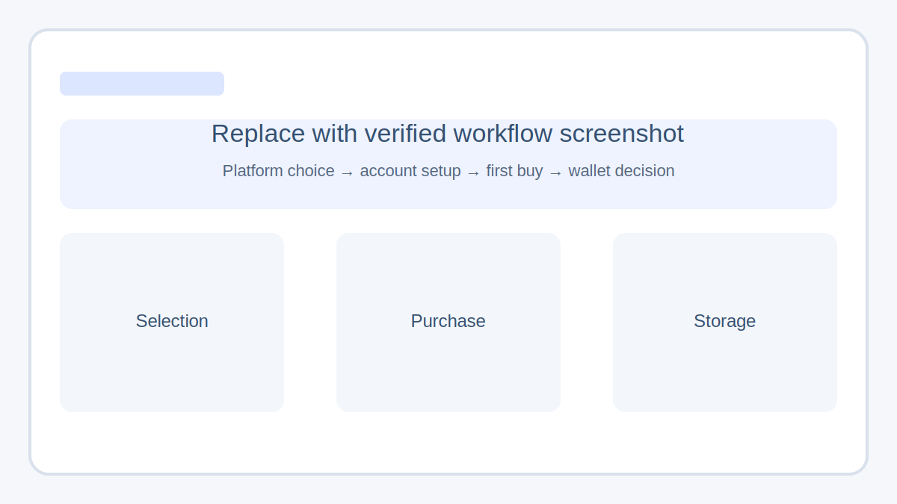
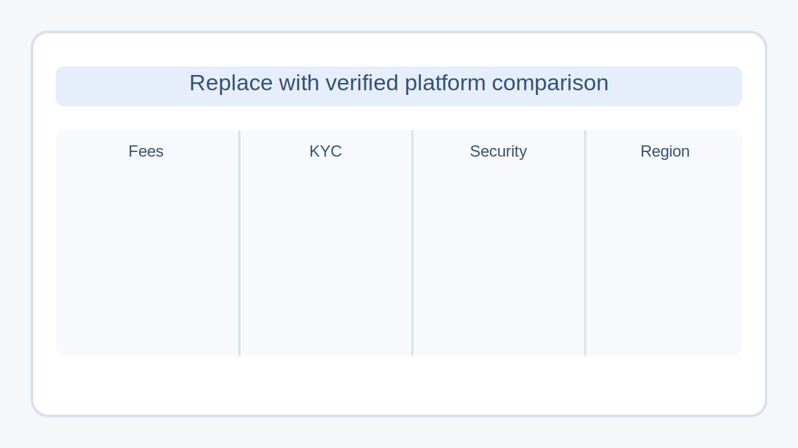
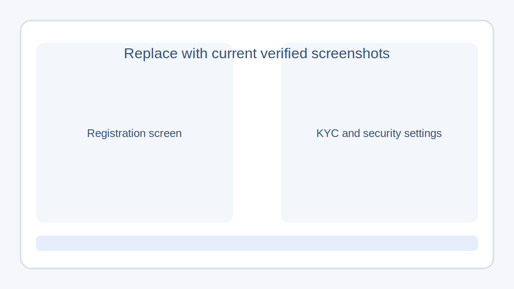
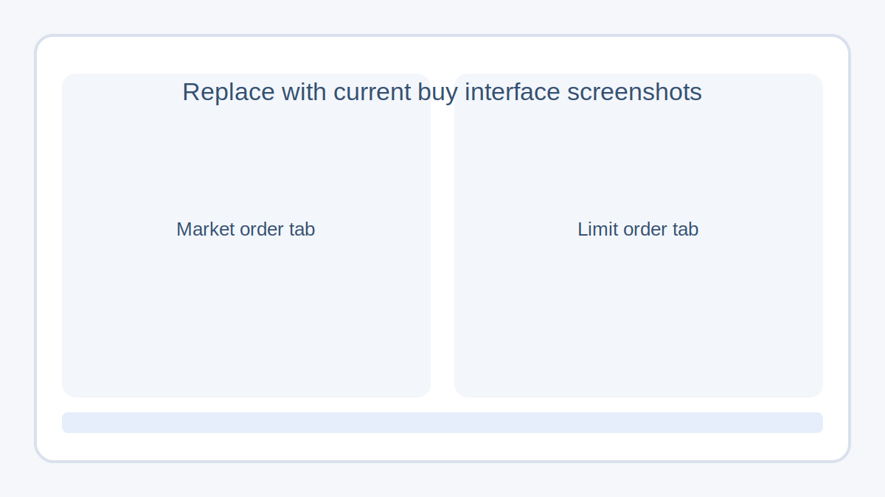
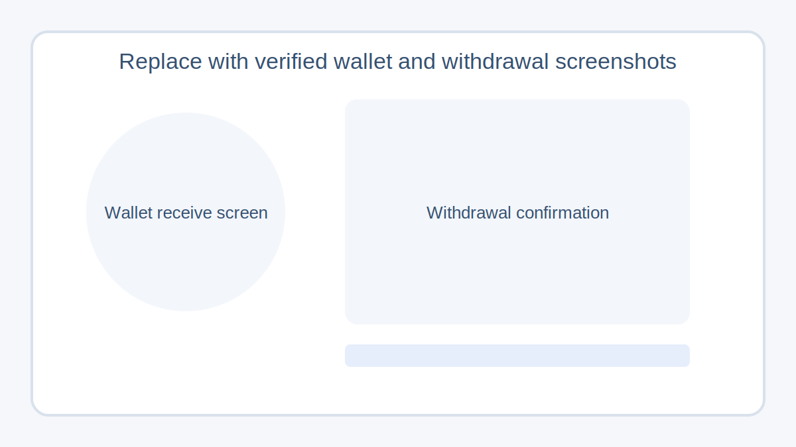

本文档亦提供[英文版](./chinese-beginner-buy-first-btc-guide.md)。

## 从 0 到购买第一笔 BTC：7 步完整指南

**最后更新：**2026-04-22  
**核验范围：**基于前序 CORE-EEAT 审计结果、公开比特币网络资料和新手操作流程的编辑刷新  
**作者：**占位，发布前请补真实作者姓名和简介  
**审核：**占位，发布前请补编辑或事实核验人

> **风险提示**
>
> 本文用于新手教育，不构成投资建议。平台可用性、支付方式、费用结构和合规要求会因地区不同而变化。你在实际操作前，应先确认自己所在地区适用的最新规则与风险。

> **快速结论**
>
> 新手购买第一笔 BTC，最稳妥的做法是：先确认目标和预算，选择自己可以合法使用的平台，先完成实名和账户安全设置，再用小额完成第一笔测试单；如果准备长期持有，再进一步学习钱包和备份。

## 你会在这篇文章里学到什么

- 什么情况下适合开始第一笔 BTC 购买
- 选平台时真正该看哪些点
- 如何用更低出错率完成第一笔买入
- 买完以后该放平台还是转钱包
- 新手最容易踩的坑有哪些

## 目录

1. [什么是 BTC，为什么很多新手先从它开始](#step-what-is-btc)
2. [第 1 步：先确认目标、预算和持有周期](#step-1)
3. [第 2 步：正确比较平台](#step-2)
4. [第 3 步：注册并完成 KYC](#step-3)
5. [第 4 步：先小额入金测试](#step-4)
6. [第 5 步：完成第一笔下单](#step-5)
7. [第 6 步：决定 BTC 放在哪里](#step-6)
8. [第 7 步：补齐三层安全保护](#step-7)
9. [新手常见错误](#common-mistakes)
10. [购买前检查清单](#pre-buy-checklist)
11. [常见问题](#faq)

## 什么是 BTC，为什么很多新手先从它开始

BTC 是比特币网络的原生资产。比特币依赖公开的区块链账本和分布式确认机制运行。Bitcoin.org 的公开说明提到，交易通常会在大约 10 到 20 分钟内开始被确认，而比特币白皮书仍然是理解这套系统的核心资料之一
([Bitcoin.org — How it works](https://bitcoin.org/en/how-it-works)，
[Bitcoin paper](https://bitcoin.org/bitcoin.pdf))。

很多新手会先从 BTC 开始，不是因为它一定涨得最快，而是因为：

- 它的认知度最高，资料更容易找。
- 主流平台通常都会优先支持它。
- 钱包、安全、转账这些基础概念更容易围绕 BTC 学会。
- 对第一次接触加密资产的人来说，先学会一条标准路径，比一开始就研究很多小币种更稳。

*截图占位：发布前替换为真实流程图，覆盖从选平台到保管资产的完整路径。*

## 第 1 步：先确认目标、预算和持有周期

在你注册任何平台之前，先把下面 3 个问题写下来。后面的每一步，其实都取决于这三个答案。

### 你买这第一笔 BTC 的目的是什么

大多数新手的第一笔买入，通常属于下面三类：

- **学习型**：先用很小的金额熟悉整套流程。
- **配置型**：把一小部分闲钱当成长周期配置。
- **交易型**：准备围绕短期价格波动做买卖。

如果这是你的第一次购买，学习型或者小额配置型通常更合适。这样做的好处，不是“更保守”这么简单，而是能把第一次犯错的成本压到最低。

### 你能承受多大的下跌和波动

第一次买币，不应该用你不能承受损失的钱。更稳的做法，是把第一笔订单视为一次流程测试，而不是一次观点表达。即使你后面准备投入更大的金额，第一笔也更适合先小额走通。

### 你准备持有多久

| 持有目标 | 更适合的做法 | 核心关注点 |
| --- | --- | --- |
| 先体验流程 | 小额测试单 | 少犯错 |
| 持有数月 | 分批买入 | 成本和纪律 |
| 持有一年以上 | 尽早学习钱包 | 备份和保管 |

## 第 2 步：正确比较平台

很多新手第一步就走偏，不是因为不会买，而是因为选平台时只看品牌热度，没看真正影响体验和风险的东西。

### 先看你能不能合法、稳定地使用它

不要因为某个平台“很有名”就默认它适合你。支付渠道、实名要求、可买的产品、是否支持你所在地区，都会影响实际使用体验。有些限制并不是注册时才出现，而是等你入金、买入或提币时才暴露出来。

### 不只看买入费，要看整条费用链路

新手最容易漏掉的成本包括：

- 交易手续费
- 入金手续费
- 提币手续费
- 银行卡或 P2P 的价差
- 链上转出时的网络费

### 真正重要的是安全控制项

在你入金之前，至少先确认平台是否支持：

- 双重验证
- 提币地址白名单
- 登录提醒
- 设备管理
- 反钓鱼码或类似校验功能

### 帮助中心是否说得清楚

一个平台的帮助中心、费率页、提币说明是否清晰，本身就是质量信号。如果相关页面写得很模糊，后面的操作体验通常也不会太友好。

*截图占位：发布前替换为你目标地区可用平台的对比截图，或做成可核验的对比表图。*

## 第 3 步：注册并完成 KYC

大多数主流平台都会要求你完成 KYC，之后才能解锁更完整的入金、买入或提币功能。Bitcoin.org 也提醒新用户，在真正使用比特币前，先理解基本规则和常见陷阱会更安全
([Bitcoin.org — Getting started](https://bitcoin.org/en/getting-started))。

常见注册流程通常包括：

1. 用邮箱或手机号创建账户。
2. 设置单独的强密码。
3. 完成实名和身份验证。
4. 开启安全功能。
5. 等审核通过后再进行下一步。

### 安全设置要放在入金之前

很多人会本能地先入金，再回头补安全设置。这个顺序是反的。更好的顺序是：

- 先打开双重验证
- 保存好备用恢复码
- 检查提币保护项
- 确认官方客服和官方域名

*截图占位：发布前替换为实际注册、实名和安全设置流程截图，并在证据台账中记录平台、地区和核验日期。*

## 第 4 步：先小额入金测试

把第一次入金当成一次系统联调，而不是一次正式建仓。这一步的目标不是多买，而是确认：

- 入金路径是否通畅
- 到账时长是否正常
- 是否出现额外费用
- 后续买入界面你是否真正看得懂

如果你后面准备投入更大的金额，第一次也更适合先用小额跑完整条链路。这样做不是拖慢进度，而是避免把不熟悉流程时的错误放大。

## 第 5 步：完成第一笔下单

对第一次购买的人来说，最需要理解的通常就两种下单方式。

### 市价单

市价单会按当前市场能成交的价格尽快完成买入。它更简单，所以适合作为第一笔小额测试单。缺点是最终成交价不一定和你刚看到的价格完全一致。

### 限价单

限价单允许你自己指定买入价格。它能帮你更好地控制价格，但前提是市场真的来到那个价格，否则订单可能一直挂着不成交。

### 新手第一次更适合哪种

- 如果你主要是为了先完成第一笔操作并看懂整个流程，小额市价单通常更容易上手。
- 如果你已经理解了挂单和成交逻辑，限价单会更适合做成本控制。

第一次下单时，最重要的不是“会不会抄到底”，而是确认你知道自己买了什么、花了多少费用、最终拿到了多少 BTC。

*截图占位：发布前替换为当前买入界面的真实截图，并标注市价、限价、费用和确认按钮位置。*

## 第 6 步：决定 BTC 放在哪里

买到 BTC 和把 BTC 保管好，是两件相关但不相同的事。

### 放在平台账户里

如果金额很小，而且你还在熟悉流程，短期放在平台里会更方便。但这等于你把安全的一部分交给平台处理，所以它适合的是“学习期”和“小额余额”。

### 转到个人钱包

如果你打算长期持有，就应该尽早学习自托管。Bitcoin.org 在基础说明里提到，钱包会生成地址并管理签名交易所需的密钥
([Bitcoin.org — How it works](https://bitcoin.org/en/how-it-works))。

对新手来说，先记住这个简单区别就够：

- **热钱包**：联网，更方便，操作更快
- **冷钱包**：更不方便，但通常更适合长期保存

### 提币前一定做两次检查

1. 仔细确认地址和网络。
2. 先发一笔小额测试。

一次小测试的成本，通常远低于一次不可逆的错误转账。

*截图占位：发布前替换为真实的钱包收款页和提币确认页截图，重点标出地址、网络和测试转账步骤。*

## 第 7 步：补齐三层安全保护

如果没有安全设置，第一笔买币其实还没有真正完成。

### 第 1 层：账户安全

- 密码单独设置，不与常用账户复用
- 双重验证始终开启
- 不随便点击陌生消息里的登录链接

### 第 2 层：钱包安全

- 助记词或备份信息离线保存
- 不截图，不放聊天工具，不传网盘
- 恢复步骤提前写清楚，但不要暴露给别人

### 第 3 层：操作安全

- 登录前确认域名
- 提币先小额测试
- 记录时间、价格、费用和资金去向，方便复盘

## 新手常见错误

### 还没熟悉流程就先重仓

第一次买入更适合承担“学习任务”，而不是承担“结果任务”。如果一开始就重仓，任何流程性错误都会被放大。

### 只盯价格，不看总成本

很多人只比谁买得更便宜，却忽略了价差、手续费、提币费和链上费用。对新手来说，真正要比较的是总成本，而不是单点价格。

### 买完以后才开始学钱包

如果你的计划是中长期持有，那么钱包和备份不是以后再补的选修课，而是买入流程的一部分。

### 把“跟单别人”当成学习捷径

对第一次买币的人来说，最值得学会的能力，不是跟谁买，而是怎么自己完成注册、入金、下单、核验和保管。

## 购买前检查清单

在点击最终确认前，先确认下面这些：

- 我知道自己为什么买这第一笔 BTC。
- 我只用了可以承受损失的资金。
- 我确认了平台适用于我的地区。
- 我看过完整费用链路，而不只是买入价格。
- 我先完成了 KYC 和安全设置。
- 我知道买完以后放平台还是转钱包。
- 如果我要提币，我会先做一笔小额测试。

## 建议内链

- `/how-to-choose-a-crypto-exchange`
- `/crypto-wallet-basics`
- `/crypto-withdrawal-checklist`
- `/beginner-crypto-security-checklist`

## 建议外部参考

- [Bitcoin.org — Getting started](https://bitcoin.org/en/getting-started)
- [Bitcoin.org — How it works](https://bitcoin.org/en/how-it-works)
- [Bitcoin 白皮书 PDF](https://bitcoin.org/bitcoin.pdf)

## 常见问题

### 新手第一笔买多少比较合适

第一笔更适合是“小额测试单”。重点不是马上建立多大仓位，而是先学会整条流程，确认平台、费用和提币逻辑都在自己的理解范围内。

### 第一次下单更适合市价还是限价

如果你只是想先完成第一笔买入并弄懂流程，小额市价单通常更容易；如果你已经理解挂单和成交逻辑，限价单更适合控制价格。

### 买完以后一定要马上转到个人钱包吗

不一定。很小的学习型余额，短期放在平台里可能更方便；但如果你准备长期持有，就应该尽早学习钱包、备份和自托管的基本规则。

## 发布前编辑备注

- 把所有截图占位替换成最新实拍图。
- 补真实作者简介和审核信息。
- 把占位内链换成站内真实链接。
- 在模板层或 CMS 中补 HowTo 与 FAQ 结构化数据。

## Handoff Summary

- **Status**: DONE
- **Objective**: 按照审计建议刷新首购 BTC 指南，并输出为 Markdown 文件
- **Key Findings / Output**: 文章已补上摘要块、目录、引用层、信任占位和截图占位，可进入下一轮质量审计
- **Evidence**: 前序内容审计结果，加上 Bitcoin.org 与比特币白皮书的公开资料
- **Open Loops**: 真实截图、作者身份、审核人和最终内链仍需发布前补齐
- **Recommended Next Skill**: `content-quality-auditor`
